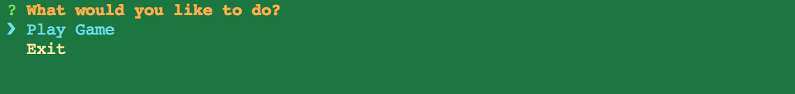
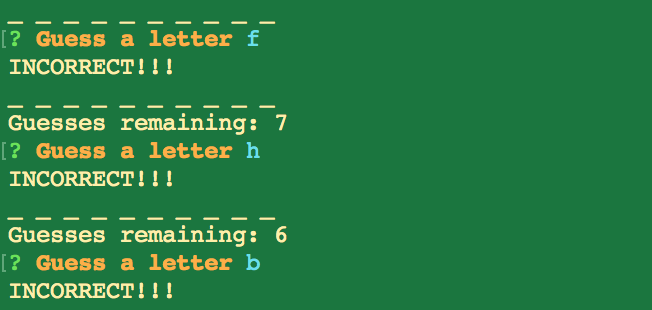

# Node Hangman with Constructors

As i was learning node and more advanced JavaScript programming I decided to re-do my hangman logic with back end technology and I used Node.js

## Getting Started
This program can only be ran in the back-end meaning the Terminal if you are on a mac or Git Bash.

After Installation run 'node index.js' to start the game after which you will be prompted to start or exit the game:

If you chose to play the game then you can choose a letter. if you get it right you keep guessing with the same amount of guesses otherwise you get it wrong and lose a guess.

Once you loose or win, the program will prompt you again to find out what you want to do.

### Prerequisites and Installation 

To install this program you need Node.js and npm

  * Clone this repositiory following instruction from GitHub - git clone <repository link>
  
  * Make sure you install dependencies - Run the command: npm install 

## Authors

* **Cesar Caceres** - *Development* 

